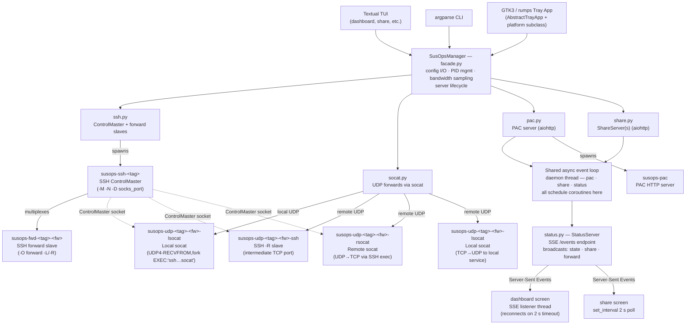

# CLAUDE.md

This file provides guidance to Claude Code (claude.ai/code) when working with code in this repository.

## Commands

```bash
# Install for development (venv at .venv/)
pip install -e ".[tui,share,dev]"

# Run all tests
pytest

# Run a single test file
pytest tests/test_facade.py

# Run a single test by name
pytest tests/test_pac.py::test_pac_server_reload -v

# Run tests with coverage
pytest --cov=susops --cov-report=term-missing

# Launch the TUI
susops        # or: python -m susops.tui

# Launch as non-interactive CLI
susops ps
susops ls
susops start
susops stop

# Launch tray app (Linux; requires system GTK3 packages)
susops-tray
```

## Architecture

Three frontends share a **single `SusOpsManager` facade** — changes to the facade or core must be reflected in all three:

| Frontend    | Entry point                | Notes                                         |
|-------------|----------------------------|-----------------------------------------------|
| TUI         | `src/susops/tui/`          | Textual 8.2.3 + textual-plotext 1.0.1         |
| Tray Linux  | `src/susops/tray/linux.py` | GTK3 + AyatanaAppIndicator3 (system packages) |
| Tray macOS  | `src/susops/tray/mac.py`   | rumps + PyObjC                                |

```
src/susops/
  facade.py          # SusOpsManager — only public API any frontend should use
  core/
    config.py        # Pydantic v2 models + ruamel.yaml I/O
    ssh.py           # SSH ControlMaster/slave subprocess + PID tracking + socket helpers
    socat.py         # UDP port forwarding via socat EXEC + SSH ControlMaster
    pac.py           # PAC JS generation + aiohttp HTTP server (shared async loop)
    share.py         # AES-256-CTR HTTP file sharing + client fetch (shared async loop)
    status.py        # SSE StatusServer — aiohttp, broadcasts state/share/forward events
    process.py       # PID-file-based process manager (~/.susops/pids/) + zombie detection
    ports.py         # validate_port(), is_port_free(), free port allocation, CIDR helpers
    types.py         # ProcessState enum, result dataclasses (StartResult, ShareInfo etc.)
  tui/
    __main__.py      # dual-mode: TUI if isatty() + no subcommand, else CLI dispatch
    cli.py           # argparse non-interactive CLI
    app.py           # SusOpsTuiApp (Textual App subclass), CSS_PATH=app.tcss
    app.tcss         # global CSS theme for all screens
    screens/
      dashboard.py         # split-pane: sidebar (ListView) + TabbedContent detail panel
      connection_editor.py # CRUD editor with ModalScreen dialogs + detail preview
      share.py             # file share + fetch with ModalScreen dialogs
      config_editor.py     # read-only YAML viewer, press e to open $EDITOR
  tray/
    base.py          # AbstractTrayApp — all shared business logic
    linux.py         # GTK3 implementation of abstract methods
    mac.py           # rumps implementation of abstract methods
```

### Component Relations



## Key Design Patterns

**Facade is the only entry point.** Never import from `susops.core.*` in a frontend — always go through `SusOpsManager`. The facade owns config I/O, PID file management, bandwidth sampling, and the PAC/share/status server lifecycle.

**SSH ControlMaster + `-O forward`/`-O cancel`.** Each connection runs one ControlMaster process. The master command contains only the SOCKS proxy (`-D socks_port`) — no `-L`/`-R` flags — so process arguments stay minimal and forward destinations are never visible in `ps aux`. Forwards are registered live via `ssh -O forward` through the Unix socket (`~/.susops/sockets/<tag>.sock`) and released via `ssh -O cancel`. On reconnect, `_ReconnectMonitor` detects the socket coming back and calls `_reregister_forwards` to re-register all enabled forwards. No separate slave processes are tracked — the master owns all port bindings.

- `start_master(conn, ...)` — starts the ControlMaster; enabled TCP forwards are bundled in the command and python restarts them atomically on reconnect
- `start_forward(conn, fw, direction, workspace)` — registers a forward live via `ssh -O forward` (no process spawned; master holds the port)
- `cancel_forward(conn, fw, direction, workspace)` — releases a master-held port via `ssh -O cancel`
- `stop_tunnel(conn_tag, ...)` — stops the ssh master (and all its forwards)
- `find_master_pid(tag, workspace)` — scans `/proc/*/cmdline` to recover PID when the PID file is stale
- `is_socket_alive(tag, workspace)` — runs `ssh -O check` against the socket to verify liveness

**UDP port forwarding via socat.** `core/socat.py` manages UDP forwards through the existing ControlMaster socket. Two architectures depending on direction:

- **Local UDP** (`direction="local"`): one `socat` process with `UDP4-RECVFROM:port,reuseaddr,fork EXEC:'ssh -o ControlPath=<sock> -T <host> socat - UDP4-SENDTO:dst:port'`. Each datagram forks a child that opens one SSH channel through the ControlMaster and runs a remote `socat` instance. No TCP intermediate port needed. `-T15` closes idle fork children after 15 s.

  ```mermaid
  flowchart LR
      Client["UDP client"] -->|UDP| LSOcat["lsocat\nUDP4-RECVFROM,fork\nEXEC:'ssh...'"]
      LSOcat -->|"fork → SSH channel"| RSOcat["remote socat\nsocat - UDP4-SENDTO"]
      RSOcat -->|UDP| Service["UDP service"]
  ```

  Process name: `susops-udp-<conn>-<fw>-lsocat`

- **Remote UDP** (`direction="remote"`): three processes using an intermediate TCP port allocated by `get_random_free_port()`:
  1. `ssh` slave — `-R intermediate:localhost:intermediate` through ControlMaster socket (process: `…-ssh`)
  2. Remote socat via SSH exec — `UDP4-RECVFROM:src_port,fork TCP4:localhost:intermediate` (process: `…-rsocat`)
  3. Local socat — `TCP4-LISTEN:intermediate,fork UDP4-SENDTO:dst_addr:dst_port` (process: `…-lsocat`)

  ```mermaid
  flowchart LR
      RClient["UDP client\n(remote)"] -->|UDP| RSOcat["rsocat on remote\nUDP4-RECVFROM,fork\nTCP4:intermediate"]
      RSOcat -->|"TCP (via SSH -R tunnel)"| LSOcat["lsocat on local\nTCP4-LISTEN\nUDP4-SENDTO"]
      LSOcat -->|UDP| Service["UDP service\n(local)"]
  ```

Key implementation notes:
- EXEC quoting: `EXEC:'<cmd>'` (single quotes inside the socat argument) is required when the exec'd command has spaces — without them socat errors "wrong number of parameters".
- `socat.py` public API: `start_udp_forward`, `stop_udp_forward`, `stop_all_udp_forwards_for_connection`. All are called from `facade.py`; never call from frontends directly.
- `stop_all_udp_forwards_for_connection` is called unconditionally in `stop()` — socat processes may outlive a crashed SSH master and must be cleaned up regardless of whether `stop_tunnel` succeeded.
- `UDP4-SENDTO` is used (not `UDP4-DATAGRAM`) — unconnected socket allows receipt from any source address, which is required for protocols where the server responds from a different port.

**Zombie detection.** `process.py:is_running()` reads `/proc/{pid}/status` and checks for `State: Z`. Zombies are reaped with `os.waitpid(pid, os.WNOHANG)`, their PID file deleted, and `False` returned so callers treat them as stopped. `os.kill(pid, 0)` alone is not sufficient — it returns 0 for zombies.

**Shared async event loop.** A single daemon thread runs a `asyncio` event loop (`_get_loop()` in `share.py`). All `ShareServer` instances, the `PacServer`, and the `StatusServer` schedule their aiohttp coroutines onto this loop via `asyncio.run_coroutine_threadsafe`. This means there is always exactly one background thread for all async I/O regardless of how many shares are active.

**SSE status events.** `StatusServer` (`core/status.py`) is an aiohttp server exposing `GET /events` as a Server-Sent Event stream. The facade calls `_emit(event, data)` on every state change; this pushes a JSON payload to all connected clients. Event types: `state` (connection start/stop), `share` (share start/stop), `forward` (forward change), `bandwidth` (periodic throughput). The dashboard screen maintains an SSE listener thread (reconnects every 2 s on timeout) for instant refresh on events. The share screen uses `set_interval(2.0, self._reload)` instead (simpler, no reconnect churn).

**Thread safety in the TUI.** All blocking calls (start/stop/restart, share, fetch, editor launch) use `@work(thread=True)`. Results are pushed back with `self.app.call_from_thread(...)`, never `self.call_from_thread(...)` (which doesn't exist on `Screen`). The fetch dialog (`_FetchDialog`) is a `ModalScreen` that performs the download itself with `@work(thread=True)`, keeps inputs enabled for retry on error, and dismisses only on success.

**Per-connection vs. all-connections operations.** `start(tag=)`, `stop(tag=)`, `restart(tag=)` all accept an optional tag. When `stop(tag=conn_tag)` is called:
- Only that connection's tunnel (ControlMaster + all its slaves) is stopped
- File shares belonging to that connection are also stopped
- PAC server and other connections are left running

**Bandwidth sampling.** `_BandwidthSampler` (inside `facade.py`) is a daemon thread that reads `read_chars`/`write_chars` from `/proc/pid/io` every 2 s — these include socket I/O, unlike `read_bytes`/`write_bytes` which only count disk. `get_bandwidth(tag)` is a non-blocking dict lookup.

**Multi-share.** `_share_servers: dict[int, tuple[ShareServer, ShareInfo]]` in the facade is keyed by port, allowing concurrent shares on different ports. Each `ShareServer` tracks `access_count` and `failed_count` in memory (not persisted). `list_shares()` attaches live counts to the returned `ShareInfo` via `dataclasses.replace`.

**Three-state ShareInfo.** `ShareInfo` has two boolean flags:
- `running=True` — server is active (green ●)
- `running=False, stopped=True` — user manually stopped it (dim ○); will NOT auto-restart
- `running=False, stopped=False` — connection went down (red ○); will auto-restart when connection comes back

**Fetch lifecycle.** `fetch()` always calls `_start_master_only(conn_tag)` first (it's a no-op if the master is already up but ensures the socket is ready). The `tunnel_was_running` flag is captured before this call to decide teardown: if the fetch started the connection, `stop_tunnel` is called in the `finally` block to restore the original state. `_start_master_only` starts ONLY the ControlMaster — no configured forwards, PAC, or file shares are touched.

**TUI dashboard.** Split-pane: 36-col `VerticalScroll` sidebar (Connections `ListView`, PAC `Static`, Shares `Static`) + `TabbedContent` detail panel (Stats / Bandwidth with `PlotextPlot` / Forwards `DataTable` / Logs `RichLog`). Selection in the `ListView` drives the right panel via `on_list_view_highlighted`. Auto-refreshes every 2 seconds via `set_interval` with adaptive idle throttling (every 10 s when all connections stopped). SSE listener triggers immediate refresh on events.

**List refresh without deselection.** When refreshing a `ListView` that may not have changed, update labels in-place (`item.query_one(Label).update(text)`) rather than clearing and repopulating. Only rebuild the list when items are added or removed, and restore `lv.index` afterward. This is the pattern used in both the dashboard connection list and the share screen.

**Modal dialogs.** All dialogs subclass `ModalScreen` (not `Screen`) so Textual dims the background automatically. They use `self.dismiss(data)` to return results to the caller via the push_screen callback.

**Port forward bind addresses.** `PortForward` has `src_addr` and `dst_addr` fields (default `"localhost"`). Valid bind options: `localhost`, `172.17.0.1` (Docker bridge), `0.0.0.0`. All frontends validate ports with `validate_port()` from `core/ports.py` and check `is_port_free()` for locally-bound ports before accepting input.

**Select widget values.** In Textual 8.x, an empty Select returns `Select.NULL` (a `NoSelection` instance), not `Select.BLANK`. Always check `isinstance(val, str)` rather than `val is not Select.BLANK` when reading Select values.

**Tray abstraction.** `AbstractTrayApp.do_*` methods contain all business logic. Platform subclasses implement `update_icon`, `update_menu_sensitivity`, `show_alert`, `show_output_dialog`, `run_in_background`, and `schedule_poll`. Linux uses `Gtk.ComboBoxText(has_entry=True)` for bind address combos (read via `get_child().get_text()`). macOS uses sequential `rumps.Window` text prompts.

## Config & Runtime State

- Config file: `~/.susops/config.yaml` (Pydantic model, ruamel.yaml preserves comments)
- PID files: `~/.susops/pids/susops-ssh-<tag>.pid`, `susops-fwd-<tag>-<fw>.pid`, `susops-pac.pid`
- UDP process PID files: `susops-udp-<tag>-<fw>-lsocat.pid`, `…-rsocat.pid`, `…-ssh.pid`
- Socket files: `~/.susops/pids/susops-<tag>.sock` (SSH ControlMaster socket)
- Log files: `~/.susops/logs/<process-name>.log` — socat/SSH stderr for UDP processes goes here
- Port `0` in config means auto-assign at start; the chosen port is written back to config
- `ephemeral_ports: true` in `susops_app:` section skips the write-back (ports stay 0)

## Port Forward Config Shape

```yaml
forwards:
  local:
    - src_port: 5432       # local port to bind
      src_addr: localhost   # local bind address
      dst_port: 5432        # remote port
      dst_addr: db.internal # remote host
      tag: postgres
      tcp: true             # SSH -L slave (default true)
      udp: false            # socat EXEC approach (default false)
  remote:
    - src_port: 8080       # remote port to bind on SSH server
      src_addr: localhost   # remote bind address
      dst_port: 8080        # local port to forward to
      dst_addr: localhost   # local bind address
      tag: webserver
      tcp: true             # SSH -R slave
      udp: false            # 3-process TCP bridge approach
```

`tcp` and `udp` are independent — both can be `true` to forward the same port over both protocols simultaneously. At least one must be `true`. The facade calls `start_forward` for TCP and `start_udp_forward` for UDP separately, and cleans them up independently on stop.

## Adding a New Feature Checklist

1. Add method to `SusOpsManager` in `facade.py`
2. Call `_emit(event, data)` for any state change that frontends should react to
3. Update **TUI** screen(s) that expose the feature
4. Update **`AbstractTrayApp`** (`tray/base.py`) with a `do_*` method
5. Update **`linux.py`** and **`mac.py`** to wire the new menu item / dialog
6. Add tests in `tests/`
