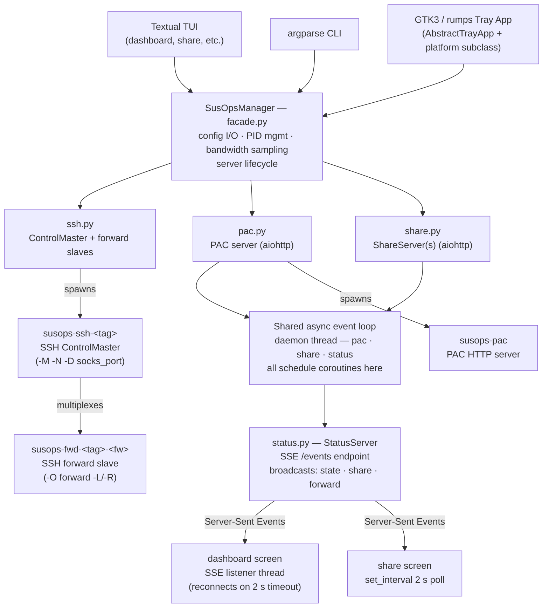

<p align="center">
    
</p>

# SusOps - SSH Utilities & SOCKS5 Operations

SSH SOCKS5 proxy manager with PAC server, Textual TUI, and system tray apps.

## Overview

SusOps manages SSH SOCKS5 proxy tunnels and serves a PAC (Proxy Auto-Config) file so browsers and other tools route traffic through your tunnels automatically. It replaces a 1600-line Bash CLI with a modern Python stack:

- **Textual TUI** — interactive split-pane dashboard, live bandwidth charts, CRUD editor, integrated log viewer
- **Non-interactive CLI** — scriptable `susops` command with semantic exit codes
- **Linux tray app** — GTK3 + AyatanaAppIndicator3
- **macOS tray app** — rumps + PyObjC
- **Shared Python core** — all business logic in `susops.core`, used by every frontend

### Architecture

```
susops/
  src/susops/
    core/          # Business logic (no UI)
      config.py    # Pydantic v2 models + ruamel.yaml I/O
      ssh.py       # SSH ControlMaster/slave subprocess + PID tracking + socket helpers
      pac.py       # PAC generation + aiohttp HTTP server (shared async loop)
      share.py     # AES-256-CTR encrypted file sharing + client fetch (shared async loop)
      status.py    # SSE StatusServer — broadcasts state/share/forward events via aiohttp
      process.py   # ProcessManager: PID files, start/stop/status, zombie detection
      ports.py     # Free port allocation, CIDR helpers
      types.py     # Enums and result dataclasses (ShareInfo with three-state status)
    facade.py      # SusOpsManager — single API for all frontends
    tui/           # Textual TUI + argparse CLI
    tray/          # GTK3 (Linux) and rumps (macOS) tray apps
```

#### Component relations



---

## Requirements

| Component    | Requirement                                                           |
|--------------|-----------------------------------------------------------------------|
| Python       | ≥ 3.11                                                                |
| SSH tunnels  | `ssh` (OpenSSH, for ControlMaster support)                            |
| PAC server   | `aiohttp >= 3.9` (shared async loop)                                  |
| TUI          | `textual >= 8.2`, `textual-plotext >= 1.0` (optional extra)           |
| File sharing | `cryptography >= 42`, `aiohttp >= 3.9` (optional extra)               |
| Linux tray   | `python-gobject`, `gtk3`, `libayatana-appindicator` (system packages) |
| macOS tray   | `rumps >= 0.4`                                                        |

---

## Installation

### pip

```bash
# CLI only (no TUI, no tray)
pip install susops

# TUI
pip install "susops[tui]"

# TUI + encrypted file sharing
pip install "susops[tui,share]"

# Linux tray (system GTK3 packages must be installed separately)
pip install "susops[tui,share,tray-linux]"

# macOS tray
pip install "susops[tui,share,tray-mac]"
```

### Arch Linux (AUR)

```bash
yay -S susops
# Optional TUI: yay -S python-textual
# Optional file sharing: yay -S python-cryptography
```

### macOS (Homebrew)

```bash
brew install mashb1t/susops/susops
```

### From source

```bash
git clone https://github.com/mashb1t/susops
cd susops
pip install -e ".[tui,share,dev]"
```

---

## Quick Start

```bash
# Add your first SSH connection
susops add-connection work user@bastion.example.com

# Add hosts that should route through the proxy
susops add *.internal.example.com
susops add 10.0.0.0/8

# Start tunnels + PAC server
susops start

# Check status
susops ps

# Point your browser at the PAC URL
susops ps   # shows PAC port, e.g. http://localhost:51234/susops.pac
```

---

## TUI

Run `susops` (or `so`) with no arguments in a terminal to launch the interactive TUI:

```
susops
```

### Keybindings

#### Dashboard — selected connection

| Key | Action                          |
|-----|---------------------------------|
| `s` | Start selected connection       |
| `x` | Stop selected connection        |
| `r` | Restart selected connection     |

#### Dashboard — all connections

| Key | Action               |
|-----|----------------------|
| `S` | Start all tunnels    |
| `X` | Stop all tunnels     |
| `R` | Restart all tunnels  |

#### Global

| Key      | Action               |
|----------|----------------------|
| `c`      | Connection editor    |
| `f`      | File share screen    |
| `e`      | Config editor (YAML) |
| `Ctrl+P` | Command palette      |
| `q`      | Quit                 |

#### Per screen

| Key      | Action                                          |
|----------|-------------------------------------------------|
| `Escape` | Back to dashboard                               |
| `a`      | Add item (connection, PAC host, forward, share) |
| `d`      | Delete / stop selected item                     |
| `f`      | Fetch a remote shared file (share screen)       |

### Screens

**Dashboard** (default) — split-pane view. Left sidebar shows all connections (status dot, SOCKS port, live throughput), PAC server status, and active file shares. Right panel is tabbed:
- **Stats** — CPU%, memory, active connections, PID for the selected connection
- **Bandwidth** — live RX and TX line charts (PlotextPlot, 60-sample rolling window, auto-scaled units)
- **Forwards** — DataTable of all port forwards (direction, local port, local bind, remote port, remote bind, label)
- **Logs** — RichLog of all tunnel output, auto-refreshed every 3 seconds

**Connection editor** — tabbed CRUD editor for Connections, PAC Hosts, Local Forwards, and Remote Forwards. Press `a` to add, `d` to delete. All add dialogs are modal overlays (dimmed background). A detail preview panel at the bottom shows expanded info for the selected row.

**Share screen** — split-pane: left list of shares with three-state indicators (green = running, dim = manually stopped, red = offline/connection down), right panel with file details, URL, password, access counts, and fetch commands. Press `a` to share a new file, `f` to fetch a remote share, `d` to stop a share, `s` to restart a stopped share, `x` to delete. Refreshes every 2 seconds via `set_interval` to reflect connection state changes.

**Config editor** — read-only YAML view of `~/.susops/config.yaml`. Press `e` to open in `$EDITOR`.

---

## CLI Reference

When a subcommand is given (or stdout is not a TTY), `susops` runs in non-interactive mode:

```
susops [-c TAG] COMMAND [args]

  -c, --connection TAG   Target a specific connection by tag
```

### Commands

#### Connection management

```bash
susops add-connection <tag> <user@host> [socks_port]
# Add a new SSH connection. Port 0 = auto-assign on start.

susops rm-connection <tag>
# Remove a connection (stops it first if running).
```

#### Lifecycle

```bash
susops start [-c TAG]     # Start tunnel(s) + PAC server (omit -c for all)
susops stop  [-c TAG] [--keep-ports] [--force]
susops restart [-c TAG]
```

`-c TAG` targets a single connection; omit to operate on all connections.
When stopping a single connection its associated file shares are also stopped.
`--keep-ports` preserves assigned port numbers across restarts.
`--force` sends SIGKILL instead of SIGTERM.

#### Status

```bash
susops ps    # Show running state; exit 0=all running, 2=partial, 3=stopped
susops ls    # List full config (connections, PAC hosts, forwards)
```

#### PAC hosts and port forwards

```bash
# PAC host (routes matching traffic through SOCKS proxy)
susops add <host>              # e.g. *.example.com, 10.0.0.0/8, host.example.com
susops rm  <host>

# Local port forward (-L equivalent)
susops add -l <local_port> <remote_port> [label] [local_bind] [remote_bind]
susops rm  -l <local_port>

# Remote port forward (-R equivalent)
susops add -r <remote_port> <local_port> [label] [remote_bind] [local_bind]
susops rm  -r <remote_port>
```

Bind addresses default to `localhost`. Use `0.0.0.0` to listen on all interfaces or `172.17.0.1` for Docker bridge access.

#### Testing

```bash
susops test <hostname>     # Test one host through SOCKS proxy
susops test --all          # Test all PAC hosts; exit 0 if all pass
```

#### File sharing

```bash
# Share a file (AES-256-CTR encrypted over HTTP)
susops share <file> [password] [port]
# Prints URL + password + fetch command

# Fetch a shared file through an SSH tunnel
susops fetch <port> <password> [outfile]
# Auto-starts the connection if not running; stops it again after download
# Saves to ~/Downloads/<original_filename> if outfile omitted
```

#### Browser launch

```bash
susops chrome     # Launch Chrome/Chromium with --proxy-pac-url
susops firefox    # Launch Firefox with a temporary PAC profile
```

#### Reset

```bash
susops reset [--force]    # Kill all processes, wipe ~/.susops workspace
```

### Exit codes

| Code | Meaning |
|------|---------|
| `0` | Success / all running |
| `1` | Error |
| `2` | Partial (some services stopped) |
| `3` | All stopped |

---

## System Tray

### Linux

```bash
susops-tray
```

Requires (system packages):
- Arch: `sudo pacman -S python-gobject gtk3 libayatana-appindicator`
- Ubuntu/Debian: `sudo apt install python3-gi gir1.2-gtk-3.0 gir1.2-ayatana-appindicator3-0.1`

### macOS

```bash
susops-tray
```

Requires `rumps`: `pip install "susops[tray-mac]"`

The tray icon reflects the current state (running/partial/stopped). The menu provides Start, Stop, Restart, Test connections, Show status, browser launch, and Quit. State is polled every 5 seconds.

Both tray implementations support full CRUD for connections, PAC hosts, and port forwards (with bind address selection) via native dialogs.

---

## Configuration

Config is stored at `~/.susops/config.yaml`. It is created automatically on first use.

```yaml
pac_server_port: 51234
connections:
  - tag: work
    ssh_host: user@bastion.example.com
    socks_proxy_port: 51235
    pac_hosts:
      - "*.internal.example.com"
      - "10.0.0.0/8"
    forwards:
      local:
        - src_port: 5432
          src_addr: localhost
          dst_port: 5432
          dst_addr: db.internal.example.com
          tag: postgres
        - src_port: 8080
          src_addr: localhost
          dst_port: 80
          dst_addr: web.internal.example.com
          tag: webui
      remote: []
susops_app:
  stop_on_quit: true
  ephemeral_ports: false
  logo_style: COLORED_GLASSES
```

### Port forward bind addresses

| Field      | Description                                                                |
|------------|----------------------------------------------------------------------------|
| `src_addr` | Local bind address for local forwards; remote bind for remote forwards     |
| `dst_addr` | Remote destination host for local forwards; local bind for remote forwards |

Common values: `localhost` (default, loopback only), `0.0.0.0` (all interfaces), `172.17.0.1` (Docker bridge).

### PAC host syntax

| Pattern            | Matches                      |
|--------------------|------------------------------|
| `*.example.com`    | any subdomain of example.com |
| `10.0.0.0/8`       | any IP in 10.0.0.0/8 CIDR    |
| `host.example.com` | that exact hostname          |

### Port assignment

Ports default to `0` (auto-assign). SusOps picks a random free port from the ephemeral range (49152–65535) at start time and saves it back to `config.yaml`. Pass a specific port to `add-connection` or set it in the config to pin it.

### Workspace

All runtime data lives in `~/.susops/`:

```
~/.susops/
  config.yaml             # persistent config
  susops.pac              # generated PAC file (regenerated on start/change)
  pids/                   # PID files + socket files for each managed process
    susops-ssh-<tag>.pid  # ControlMaster PID
    susops-fwd-<tag>-<fw>.pid  # forward slave PIDs
    susops-pac.pid
    susops-<tag>.sock     # SSH ControlMaster Unix socket
  logs/                   # per-process log files
    susops-ssh-<tag>.log
  firefox_profile/        # temporary Firefox profile for PAC launch
```

---

## File Sharing

SusOps can share files over an encrypted HTTP server, useful for transferring files through an SSH tunnel. Multiple files can be shared simultaneously on different ports.

```bash
# On sender
susops share /path/to/secret.tar.gz
# Output:
#   Sharing: /path/to/secret.tar.gz
#   URL:      http://localhost:52100
#   Password: Xk7mN2qR...
#   Port:     52100
#   Fetch with: susops fetch 52100 Xk7mN2qR...

# On receiver (through the SOCKS tunnel or on the same LAN)
susops fetch 52100 Xk7mN2qR...
# Downloaded to: ~/Downloads/secret.tar.gz
```

**Protocol:** HTTP Basic auth (`:password`) + gzip compression + AES-256-CTR encryption (PBKDF2-HMAC-SHA256 key derivation, 600,000 iterations). The original filename is also encrypted and stored in `Content-Disposition`. Requires `pip install "susops[share]"`.

**Fetch behaviour:** `fetch` auto-starts the SSH ControlMaster if the connection is not running, using a minimal start (no configured forwards, PAC server, or file shares are touched). The connection is stopped again after the download completes. If the connection was already running it is left untouched.

**Share status** in the TUI uses three states:
- `●` green — server running and accessible
- `○` dim — manually stopped (will not auto-restart)
- `○` red — offline because its connection went down (auto-resumes when connection restarts)

Each share tracks successful and failed access counts in memory (shown in the detail panel; not persisted across restarts).

---

## Python API

```python
from susops.facade import SusOpsManager
from susops.core.config import PortForward

mgr = SusOpsManager()

# Add a connection
mgr.add_connection("work", "user@bastion.example.com", socks_port=0)

# Add PAC hosts
mgr.add_pac_host("*.internal.example.com", conn_tag="work")
mgr.add_pac_host("10.0.0.0/8", conn_tag="work")

# Add a local port forward (with optional bind addresses)
mgr.add_local_forward("work", PortForward(
    src_port=5432, src_addr="localhost",
    dst_port=5432, dst_addr="db.internal.example.com",
    tag="postgres",
))

# Add a remote port forward
mgr.add_remote_forward("work", PortForward(
    src_port=8080, src_addr="localhost",
    dst_port=8080, dst_addr="localhost",
    tag="webserver",
))

# Start
result = mgr.start()
print(result.message)  # "Started"

# Status
status = mgr.status()
print(status.state)    # ProcessState.RUNNING

# React to state changes
mgr.on_state_change = lambda state: print(f"State changed: {state}")
mgr.on_log = lambda msg: print(f"[LOG] {msg}")

# Test connectivity
result = mgr.test("internal.example.com")
print(result.success, result.latency_ms)

# Share a file (multiple concurrent shares supported)
from pathlib import Path
info = mgr.share(Path("/tmp/file.txt"))
print(info.url, info.password)

# Fetch a shared file
path = mgr.fetch(port=info.port, password=info.password, host="localhost")
print(path)  # ~/Downloads/file.txt

# Stop
mgr.stop()
```

---

## Development

```bash
git clone https://github.com/mashb1t/susops
cd susops
python -m venv .venv && source .venv/bin/activate
pip install -e ".[tui,share,dev]"

# Run tests
pytest

# Run tests with coverage
pytest --cov=susops --cov-report=term-missing

# Run the TUI
susops

# Run the CLI
susops ps
susops ls
```

### Project layout

```
susops/
  pyproject.toml
  src/susops/
    core/
      config.py         # Pydantic v2 + ruamel.yaml
      ssh.py            # SSH ControlMaster/slave management + socket helpers
      pac.py            # PAC generation + aiohttp HTTP server
      share.py          # AES-256-CTR file sharing + shared async event loop
      status.py         # aiohttp SSE StatusServer (/events endpoint)
      process.py        # PID file-based process manager + zombie detection
      ports.py          # Port utilities (validate_port, is_port_free, CIDR)
      ssh_config.py     # ~/.ssh/config parser
      types.py          # Enums + result dataclasses (ShareInfo three-state)
    facade.py           # SusOpsManager public API
    tui/
      __main__.py       # Dual-mode entrypoint
      cli.py            # argparse non-interactive CLI
      app.py            # Textual App (SusOpsTuiApp)
      app.tcss          # Global CSS theme
      screens/
        dashboard.py        # Split-pane dashboard (sidebar + tabbed detail)
        connection_editor.py # CRUD editor with modal dialogs
        share.py            # File share + fetch screen
        config_editor.py    # Read-only YAML viewer
    tray/
      base.py           # AbstractTrayApp
      linux.py          # GTK3 + AyatanaAppIndicator3
      mac.py            # rumps + PyObjC
  tests/
    test_config.py
    test_process.py
    test_pac.py
    test_share.py
    test_facade.py
  packaging/
    aur/PKGBUILD
    homebrew/Formula/susops.rb
    homebrew/Casks/susops.rb
```

---

## Migration from susops.sh

If you used the previous Bash-based `susops.sh`:

1. Your `~/.susops/config.yaml` is **fully compatible** — no migration needed.
2. The `go-yq` / `yq` dependency is **removed** (replaced by Python + pydantic + ruamel.yaml).
3. Process detection no longer uses `pgrep -f` / `exec -a` hacks — PID files in `~/.susops/pids/` are used instead.
4. The PAC HTTP server is now a Python `http.server` daemon thread instead of a `nc` loop.
5. `autossh` is no longer used — replaced by plain `ssh` with ControlMaster mode for stable PID tracking and multiplexed forwards.
6. All CLI commands have the same names and behavior.

---

## License

[GNU General Public License v3.0](https://github.com/mashb1t/susops/blob/main/LICENSE)
