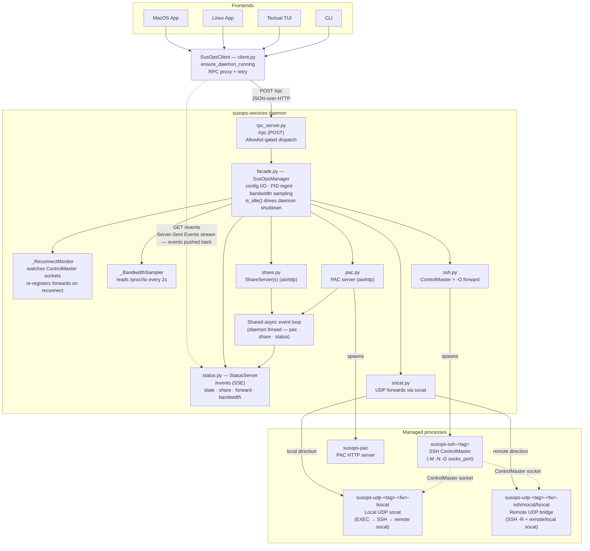
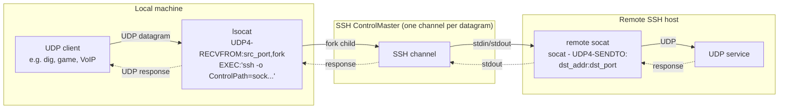
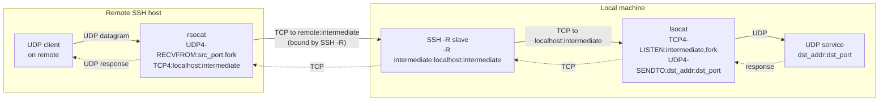

<p align="center">
    
</p>

# SusOps - SSH Utilities & SOCKS5 Operations

SSH SOCKS5 proxy manager with PAC server, TCP/UDP port forwarding, Textual TUI, and system tray apps.

## Overview

SusOps manages SSH SOCKS5 proxy tunnels and serves a PAC (Proxy Auto-Config) file so browsers and other tools route traffic through your tunnels automatically. It replaces a 1600-line Bash CLI with a modern Python stack:

- **Textual TUI** — interactive split-pane dashboard, live bandwidth charts, CRUD editor, integrated log viewer
- **Non-interactive CLI** — scriptable `susops` command with semantic exit codes
- **Linux tray app** — GTK3 + AyatanaAppIndicator3
- **macOS tray app** — rumps + PyObjC
- **Shared Python core** — all business logic in `susops.core`, used by every frontend
- **TCP port forwarding** — SSH `-L`/`-R` slaves multiplexed over the existing ControlMaster
- **UDP port forwarding** — socat over SSH ControlMaster; no extra SSH ports needed

### Architecture

SusOps is split into a **services daemon** (`susops-services`) that owns the long-lived async functionality, and **thin frontends** (CLI, TUI, tray apps) that talk to it over a local JSON-over-HTTP RPC channel plus a Server-Sent Events stream. There is one daemon per workspace. If it isn't running when a frontend starts, the frontend auto-spawns it. When the last frontend disconnects and no SSH tunnels / shares / PAC are active, the daemon exits cleanly.

```
susops/
  src/susops/
    core/                # Business logic (no UI)
      services_daemon.py # Daemon main: PID claim, signal handlers, idle-shutdown
      rpc_server.py      # aiohttp /rpc — JSON-over-HTTP, allowlist-gated dispatch
      rpc_protocol.py    # InvocationRequest/Response, type-tagged JSON encoder
      status.py          # SSE /events server — state · share · forward · bandwidth
      config.py          # Pydantic v2 models + ruamel.yaml I/O (atomic save)
      ssh.py             # SSH ControlMaster + live -O forward / -O cancel
      socat.py           # UDP port forwarding via socat over SSH ControlMaster
      pac.py             # PAC generation + aiohttp HTTP server (shared async loop)
      share.py           # AES-256-CTR encrypted file sharing + client fetch
      process.py         # ProcessManager: PID files, start/stop/status, zombie detection
      ports.py           # Free port allocation, CIDR helpers
      log_style.py       # Shared log-line styler (tag/ok/warn/err colours)
      types.py           # Enums and result dataclasses
    facade.py            # SusOpsManager — in-process API used INSIDE the daemon
    client.py            # SusOpsClient — RPC proxy used by every frontend
    tui/                 # Textual TUI + argparse CLI
    tray/                # GTK3 (Linux) and rumps (macOS) tray apps
```

#### Daemon ↔ Frontend protocol

There are two channels between each frontend and the daemon, both bound to `127.0.0.1`:

| Channel | Endpoint              | Direction        | Use                                                                                                       |
|---------|-----------------------|------------------|-----------------------------------------------------------------------------------------------------------|
| RPC     | `POST /rpc`           | frontend → daemon | One method invocation per request. Allowlisted methods from `_ALLOWED_METHODS` in `rpc_server.py` — anything else is rejected. Synchronous, request/response. |
| SSE     | `GET /events`         | daemon → frontend | Long-lived Server-Sent-Events stream. Pushes `state`, `share`, `forward`, and `bandwidth` events so frontends update instantly without polling. |

Ports are auto-allocated and written to `~/.susops/pids/susops-services.port` so frontends know where to dial. The PID file (`susops-services.pid`) is claimed atomically with `O_CREAT | O_EXCL` — two daemons racing each other can't both win, the loser exits with a clear "another daemon is running" message.

The frontend's `SusOpsClient` exposes the same API surface as `SusOpsManager` via `__getattr__` magic, so frontend code reads `mgr.start(tag="work")` the same whether it's running in-process (inside the daemon) or remoting over HTTP (everywhere else). Connection refused mid-call triggers exactly one retry through `ensure_daemon_running`, which transparently respawns the daemon if it died.

**Idle shutdown.** The daemon exits as soon as (a) the last SSE client disconnects AND (b) it has nothing tracked: no SSH masters, no shares, PAC down, reconnect monitor watching nothing. A 5 s safety-net check catches the "CLI fired one RPC and exited" case where no SSE connection ever opened. Startup gets a 3 s grace so a freshly-spawned daemon doesn't exit before its first SSE listener lands.

#### OpenAPI schema

The full RPC surface (every allowlisted method, its kwargs schema, its return type, plus the SSE event payloads) is documented as OpenAPI 3.1 at [`docs/openapi.yaml`](docs/openapi.yaml). The spec is auto-generated from `SusOpsManager` + `_ALLOWED_METHODS` via `tools/gen_openapi.py`:

```bash
python tools/gen_openapi.py             # regenerate docs/openapi.yaml
python tools/gen_openapi.py --check     # CI: fail if stale
```

A pytest case (`tests/test_openapi.py`) runs `--check` on every PR, so the committed spec can never drift from the source. Every tagged release also re-runs the generator and attaches the resulting `openapi.yaml` as a release asset, so the schema published alongside each version is always exact.

Plug the spec into Swagger UI / Redoc / Stoplight for browsable docs, or feed it into a client generator (`openapi-generator`, `oapi-codegen`, etc.) to build alternative frontends.

#### Access & authentication

The daemon is built for **single-user local-only access** — there is no authentication, no shared secret, and no per-method permission model. The protections in place are:

| Layer            | Mechanism                                                                                                                                       | What it prevents                                                                                                                                                  |
|------------------|-------------------------------------------------------------------------------------------------------------------------------------------------|-------------------------------------------------------------------------------------------------------------------------------------------------------------------|
| Bind address     | Both `/rpc` and `/events` listen on `127.0.0.1` only                                                                                            | Remote hosts on the LAN/internet cannot reach the daemon.                                                                                                         |
| Method allowlist | `_ALLOWED_METHODS` in `rpc_server.py` — any method not in the set returns `404 method not allowed`                                              | Private helpers (`mgr._whatever`) can't be invoked. Defence against *accidental* exposure, not malicious callers.                                                 |
| Port discovery   | Port + PID are written to `~/.susops/pids/susops-services.{port,pid}`                                                                           | Filesystem perms (default `0644`) gate read access. A process running as a different local user that can't read your home directory can't find the port.         |

**What this means in practice:**

- **Single-user laptop / desktop:** safe. Only your own processes can reach loopback and read the port file.
- **Multi-user host / shared dev box:** any other local user **whose UID can read `~/.susops/pids/susops-services.port`** can call any allowlisted method on your daemon. That means starting/stopping tunnels, reading config, listing shares, fetching files. The kernel doesn't help here — you'd need filesystem ACLs.
- **Untrusted local processes** (browser extensions with loopback access, sandboxed apps, etc.): same caveat. Loopback is treated as a security boundary, not a single trust zone.

**Hardening options** if you need stricter control:

- **Tighten the port file** — `chmod 600 ~/.susops/pids/susops-services.port` keeps it readable only by your UID. Not currently the default, but a one-line change to `services_daemon.py:_port_path` would make it permanent.
- **Unix domain socket instead of TCP** — bind aiohttp to `~/.susops/pids/susops-services.sock` with `0600` and kernel-enforced perms become the access control. Cleaner, no token rotation needed.
- **Per-daemon bearer token** — generate a random secret on startup, write it to `~/.susops/pids/susops-services.token` with `0600`, require it as an `Authorization: Bearer ...` header. `SusOpsClient` reads the file on each call.

None of these are implemented today; the daemon assumes a single-user trust zone. If your threat model includes co-resident users or hostile loopback-reachable software, the cheapest fix is the port-file `chmod 600`.

#### Component relations



---

## Requirements

| Component         | Requirement                                                           |
|-------------------|-----------------------------------------------------------------------|
| Python            | ≥ 3.11                                                                |
| SSH tunnels       | `ssh` (OpenSSH, for ControlMaster support)                            |
| PAC server        | `aiohttp >= 3.9` (shared async loop)                                  |
| TUI               | `textual >= 8.2`, `textual-plotext >= 1.0` (optional extra)           |
| File sharing      | `cryptography >= 42`, `aiohttp >= 3.9` (optional extra)               |
| UDP forwarding    | `socat` (system package, see [UDP Port Forwarding](#udp-port-forwarding)) |
| Linux tray        | `python-gobject`, `gtk3`, `libayatana-appindicator` (system packages) |
| macOS tray        | `rumps >= 0.4`                                                        |

---

## Installation

### pip

```bash
# CLI + daemon (no TUI, no tray)
pip install susops

# TUI
pip install "susops[tui]"

# macOS tray
pip install "susops[tui,tray-mac]"
```

The Linux tray needs system packages (`python3-gi`, `gtk3`, `libayatana-appindicator`); see below. UDP port forwarding also needs a system package (`socat`).

```bash
# macOS — socat for UDP forwarding
brew install socat

# Arch Linux — Linux tray + socat
sudo pacman -S python-gobject gtk3 libayatana-appindicator socat

# Ubuntu / Debian — Linux tray + socat
sudo apt install python3-gi gir1.2-gtk-3.0 gir1.2-ayatana-appindicator3-0.1 socat
```

### Arch Linux (AUR)

```bash
yay -S susops
# Optional TUI: yay -S python-textual
# Optional file sharing: yay -S python-cryptography
```

### macOS (Homebrew)

```bash
brew install mashb1t/susops/susops
```

### From source

```bash
git clone https://github.com/mashb1t/susops
cd susops
pip install -e ".[tui,share,dev]"
```

---

## Quick Start

```bash
# Add your first SSH connection
susops add-connection work user@bastion.example.com

# Add hosts that should route through the proxy
susops add *.internal.example.com
susops add 10.0.0.0/8

# Start tunnels + PAC server
susops start

# Check status
susops ps

# Point your browser at the PAC URL
susops ps   # shows PAC port, e.g. http://localhost:51234/susops.pac
```

---

## Services Daemon

SusOps' background services (PAC HTTP server, status SSE endpoint, reconnect monitor, bandwidth sampler) run in a single long-lived process: `susops-services`. The CLI, TUI, and tray are thin clients that talk to it over **JSON-over-HTTP RPC** (`POST /rpc`) and consume live state updates from a **Server-Sent-Events stream** (`GET /events`). If the daemon isn't running when you invoke a frontend, it's auto-spawned; the PID + RPC port are recorded in `~/.susops/pids/susops-services.{pid,port}`.

By default the daemon **exits when idle**, last SSE client disconnected AND no SSH tunnels / shares / PAC running / connections being watched. Respawning takes well under a second, so frontends don't notice. If you want it always running anyway (faster cold-start, immediate reconnect of dropped connections without any frontend open), install one of the supervisor units below.

### macOS (launchd)

```bash
cp packaging/macos/org.susops.services.plist ~/Library/LaunchAgents/
launchctl load ~/Library/LaunchAgents/org.susops.services.plist
```

Adjust the `ProgramArguments` path in the plist if `susops-services` isn't at `/usr/local/bin/susops-services` (run `which susops-services` to find yours).

### Linux (systemd-user)

```bash
mkdir -p ~/.config/systemd/user
cp packaging/linux/susops-services.service ~/.config/systemd/user/
systemctl --user daemon-reload
systemctl --user enable --now susops-services
```

The unit uses `%h/.local/bin/susops-services`, adjust if your install path differs.

---

## TUI

Run `susops` (or `so`) with no arguments in a terminal to launch the interactive TUI:

```
susops
```

### Screens

**Dashboard** (default) — split-pane view. Left sidebar shows all connections (status dot — `●` green running, `◐` orange pending, `○` dim stopped — SOCKS port, live throughput), PAC server status, and active file shares. Right panel is tabbed:
- **Stats** — CPU%, memory, active connections, PID for the selected connection
- **Bandwidth** — live RX and TX line charts (PlotextPlot, 60-sample rolling window, auto-scaled units)
- **Forwards** — DataTable of all port forwards (direction, local port, local bind, remote port, remote bind, label)
- **Logs** — RichLog of all tunnel output, auto-refreshed every 3 seconds

**Connection editor** — tabbed CRUD editor for Connections, PAC Hosts, Local Forwards, and Remote Forwards. Press `a` to add, `d` to delete, `t` to toggle enabled/disabled, `e` to run a connectivity test for the selected item, `s`/`x`/`r` to start/stop/restart. All add dialogs are modal overlays (dimmed background). A detail preview panel at the bottom shows expanded info for the selected row.

**Share screen** — split-pane: left list of shares with three-state indicators (green = running, dim = manually stopped, red = offline/connection down), right panel with file details, URL, password, access counts, and fetch commands. Press `a` to share a new file, `f` to fetch a remote share, `d` to stop a share, `s` to restart a stopped share, `x` to delete. Refreshes every 2 seconds via `set_interval` to reflect connection state changes.

**Config editor** — read-only YAML view of `~/.susops/config.yaml`. Press `e` to open in `$EDITOR`.

---

## CLI Reference

When a subcommand is given (or stdout is not a TTY), `susops` runs in non-interactive mode:

```
susops [-c TAG] COMMAND [args]

  -c, --connection TAG   Target a specific connection by tag
```

### Commands

#### Connection management

```bash
susops add-connection <tag> <user@host> [socks_port]
# Add a new SSH connection. Port 0 = auto-assign on start.

susops rm-connection <tag>
# Remove a connection (stops it first if running).
```

#### Lifecycle

```bash
susops start [-c TAG]     # Start tunnel(s) + PAC server (omit -c for all)
susops stop  [-c TAG] [--keep-ports] [--force]
susops restart [-c TAG]
```

`-c TAG` targets a single connection; omit to operate on all connections.
When stopping a single connection its associated file shares are also stopped.
`--keep-ports` preserves assigned port numbers across restarts.
`--force` sends SIGKILL instead of SIGTERM.

#### Status

```bash
susops ps    # Show running state; exit 0=all running, 2=partial, 3=stopped
susops ls    # List full config (connections, PAC hosts, forwards)
```

#### PAC hosts and port forwards

```bash
# PAC host (routes matching traffic through SOCKS proxy)
susops add <host>              # e.g. *.example.com, 10.0.0.0/8, host.example.com
susops rm  <host>

# Local port forward (-L equivalent)
susops add -l <local_port> <remote_port> [label] [local_bind] [remote_bind]
susops rm  -l <local_port>

# Remote port forward (-R equivalent)
susops add -r <remote_port> <local_port> [label] [remote_bind] [local_bind]
susops rm  -r <remote_port>
```

Bind addresses default to `localhost`. Use `0.0.0.0` to listen on all interfaces or `172.17.0.1` for Docker bridge access.

#### Testing

```bash
susops test <hostname>     # Test one host through SOCKS proxy
susops test --all          # Test all PAC hosts; exit 0 if all pass
```

#### File sharing

```bash
# Share a file (AES-256-CTR encrypted over HTTP)
susops share <file> [password] [port]
# Prints URL + password + fetch command

# Fetch a shared file through an SSH tunnel
susops fetch <port> <password> [outfile]
# Auto-starts the connection if not running; stops it again after download
# Saves to ~/Downloads/<original_filename> if outfile omitted
```

#### Browser launch

```bash
susops chrome     # Launch Chrome/Chromium with --proxy-pac-url
susops firefox    # Launch Firefox with a temporary PAC profile
```

#### Proxy setup guide

```bash
susops [-c TAG] guide    # Print copy-paste proxy config for common tools
```

Shows `socks5h://127.0.0.1:<port>` snippets for shell, Homebrew, pip, npm/yarn/pnpm, git, curl, wget, apt, Docker, and proxychains4. Uses the live port if the tunnel is running, falls back to the saved config port, or shows a `<port>` placeholder with a warning if the port is unknown.

#### Reset

```bash
susops reset [--force]    # Kill all processes, wipe ~/.susops workspace
```

### Exit codes

| Code | Meaning |
|------|---------|
| `0` | Success / all running |
| `1` | Error |
| `2` | Partial (some services stopped, or any connection pending) |
| `3` | All stopped |

A connection is **pending** when its SSH master is alive but the ControlMaster socket isn't up yet — typically while ssh-agent is waiting on a key unlock, or between reconnect attempts. `start` returns as soon as the master spawns; auth then completes asynchronously up to 60 s later. Slow agent prompts (Vaultwarden, 1Password, hardware keys) no longer freeze the UI.

---

## System Tray

### Linux

```bash
susops-tray
```

Requires (system packages):
- Arch: `sudo pacman -S python-gobject gtk3 libayatana-appindicator`
- Ubuntu/Debian: `sudo apt install python3-gi gir1.2-gtk-3.0 gir1.2-ayatana-appindicator3-0.1`

### macOS

```bash
susops-tray
```

Requires `rumps`: `pip install "susops[tray-mac]"`

The tray icon reflects the current state (running / partial-or-pending / stopped). State changes arrive over the daemon's SSE `/events` stream. If the stream drops, the listener reconnects within at most 5 seconds. When TUI + tray are both attached to the same daemon, quitting one keeps the other running — `stop_on_quit` is skipped if any other frontend is still connected.

**Note: the macOS and Linux tray apps diverge in their UI structure.** The unified Settings window described below is macOS-only for now; the Linux tray keeps the classic submenu structure.

### macOS tray

The macOS tray has a slim menu with a unified **Settings window** (open with Settings… ⌘, or from the tray menu):

Slim menu items:
- **Status line** — shows current connection state
- **Settings… ⌘,** — opens the unified config window
- **Start / Stop / Restart Proxy** — bulk lifecycle for all connections
- **Show Status** — print current state to stdout
- **Show Logs** — open the log directory
- **Launch Browser ▸** — submenu: Chrome or Firefox with the PAC URL pre-configured
- **Reset All** — kill all processes and wipe the workspace
- **About SusOps**
- **Quit ⌘Q**

The **Settings window** is a tabbed NSWindow:
- **One tab per connection** — labelled with a state dot (●/◐/○) and the connection tag. Each tab has a grouped sidebar (DOMAINS / FORWARDS / SHARES / CONNECTION) with per-item state indicators, and an **Add…** pull-down (Add Domain/IP/CIDR, Add Local Forward, Add Remote Forward, Share File…, Fetch File…) preset to the current connection. Selecting a sidebar item opens a detail panel with per-item actions: **Test**, **Toggle enabled**, **Remove** (for domains and forwards); **Reveal Password**, **Stop/Start**, **Delete** (for shares); **Start/Stop/Restart/Test/Remove** (for the connection itself).
- **+ tab** — add a new connection.
- **Gear tab (⚙)** — app-wide settings (PAC port, stop-on-quit, ephemeral ports) with **Save**, **Revert**, and **Open Config File** buttons.

### Linux tray

The Linux tray keeps the classic submenu menu structure:

- **Manage** — toggle connection/PAC host/forward enabled state; start, stop, or restart a specific connection
- **Start / Stop / Restart All** — bulk lifecycle operations across all connections
- **Test** — test SSH reachability for a specific connection, curl a domain through its SOCKS proxy, or check port liveness for a specific forward; "Test All PAC Hosts" bulk-tests every configured domain
- **CRUD** — add/remove connections, PAC hosts, and port forwards (with bind address selection)
- **Settings** — configure PAC port, stop-on-quit, and ephemeral ports
- **Browser launch** — open Chrome or Firefox with the PAC URL pre-configured
- **Quit**

---

## Configuration

Config is stored at `~/.susops/config.yaml`. It is created automatically on first use.

```yaml
pac_server_port: 51234
connections:
  - tag: work
    ssh_host: user@bastion.example.com
    socks_proxy_port: 51235
    enabled: true                       # false = skip this connection on start-all
    pac_hosts:
      - "*.internal.example.com"
      - "10.0.0.0/8"
    pac_hosts_disabled:                 # hosts temporarily disabled without removal
      - "*.staging.example.com"
    forwards:
      local:
        - src_port: 5432
          src_addr: localhost
          dst_port: 5432
          dst_addr: db.internal.example.com
          tag: postgres
          tcp: true
          udp: false
          enabled: true                 # false = forward skipped on connection start
        - src_port: 5353
          src_addr: localhost
          dst_port: 53
          dst_addr: dns.internal.example.com
          tag: dns
          tcp: false
          udp: true
          enabled: true
        - src_port: 8080
          src_addr: localhost
          dst_port: 80
          dst_addr: web.internal.example.com
          tag: webui
          tcp: true
          udp: false
          enabled: false
      remote: []
susops_app:
  stop_on_quit: true
  ephemeral_ports: false
  logo_style: COLORED_GLASSES
```

### Port forward bind addresses

| Field      | Description                                                                |
|------------|----------------------------------------------------------------------------|
| `src_addr` | Local bind address for local forwards; remote bind for remote forwards     |
| `dst_addr` | Remote destination host for local forwards; local bind for remote forwards |

Common values: `localhost` (default, loopback only), `0.0.0.0` (all interfaces), `172.17.0.1` (Docker bridge).

### Port forward protocol flags

Each forward has two boolean flags that control which transport protocols are enabled:

| Field | Default | Description                                         |
|-------|---------|-----------------------------------------------------|
| `tcp` | `true`  | Enable TCP forwarding via SSH `-L`/`-R` slave       |
| `udp` | `false` | Enable UDP forwarding via socat (requires `socat`)  |

Both can be `true` simultaneously — susops will start an SSH slave for TCP and socat process(es) for UDP independently. Requires at least one of `tcp` or `udp` to be `true`.

### PAC host syntax

| Pattern            | Matches                      |
|--------------------|------------------------------|
| `*.example.com`    | any subdomain of example.com |
| `10.0.0.0/8`       | any IP in 10.0.0.0/8 CIDR    |
| `host.example.com` | that exact hostname          |

### Port assignment

Ports default to `0` (auto-assign). SusOps picks a random free port from the ephemeral range (49152–65535) at start time and saves it back to `config.yaml`. Pass a specific port to `add-connection` or set it in the config to pin it. Ports outside `1–65535` are rejected on `add`.

### Tag format

Connection tags must match `[A-Za-z0-9][A-Za-z0-9._-]{0,63}` (no slashes, no `..`, no leading punctuation). Tags appear in PID-file names, socket paths, log lines, and PAC keys, so the format is intentionally strict.

### Workspace

All runtime data lives in `~/.susops/`:

```
~/.susops/
  config.yaml             # persistent config
  susops.pac              # generated PAC file (regenerated on start/change)
  pids/                   # PID files + socket files for each managed process
    susops-ssh-<tag>.pid  # ControlMaster PID
    susops-fwd-<tag>-<fw>.pid  # forward slave PIDs
    susops-pac.pid
    susops-<tag>.sock     # SSH ControlMaster Unix socket
  logs/                   # per-process log files
    susops-ssh-<tag>.log
  firefox_profile/        # temporary Firefox profile for PAC launch
```

### SSH Server: Forward-Only Access

To restrict the SSH user on the server to only perform port forwarding (no shell, no file transfer):

**1. Create a dedicated system user:**

```bash
sudo useradd -r -m -s /usr/sbin/nologin susops-tunnel
sudo mkdir -p /home/susops-tunnel/.ssh
sudo chmod 700 /home/susops-tunnel/.ssh
sudo chown -R susops-tunnel:susops-tunnel /home/susops-tunnel/.ssh
```

**2. Add your public key to `authorized_keys` with restrictions:**

```
# /home/susops-tunnel/.ssh/authorized_keys
restrict,port-forwarding,permitopen="any" ssh-ed25519 AAAA... your-key
```

The `restrict` keyword disables shell, PTY, agent forwarding, and X11 forwarding. `port-forwarding` re-enables only TCP forwarding. `permitopen="any"` allows forwarding to any destination — restrict with `permitopen="host:port"` for tighter control.

**3. Configure `sshd_config`:**

```
# /etc/ssh/sshd_config.d/susops.conf
Match User susops-tunnel
    AllowTcpForwarding yes
    AllowStreamLocalForwarding no
    GatewayPorts no
    X11Forwarding no
    PermitTTY no
    ForceCommand /bin/false
```

**4. Reload sshd:**

```bash
sudo systemctl reload sshd
```

The connection stays alive for SOCKS proxying and port forwards but cannot execute commands or transfer files.

---

## File Sharing

SusOps can share files over an encrypted HTTP server, useful for transferring files through an SSH tunnel. Multiple files can be shared simultaneously on different ports.

```bash
# On sender
susops share /path/to/secret.tar.gz
# Output:
#   Sharing: /path/to/secret.tar.gz
#   URL:      http://localhost:52100
#   Password: Xk7mN2qR...
#   Port:     52100
#   Fetch with: susops fetch 52100 Xk7mN2qR...

# On receiver (through the SOCKS tunnel or on the same LAN)
susops fetch 52100 Xk7mN2qR...
# Downloaded to: ~/Downloads/secret.tar.gz
```

**Protocol:** HTTP Basic auth (`:password`) + gzip compression + AES-256-CTR encryption (PBKDF2-HMAC-SHA256 key derivation, 600,000 iterations). The original filename is also encrypted and stored in `Content-Disposition`.

**Fetch behaviour:** `fetch` auto-starts the SSH ControlMaster if the connection is not running, using a minimal start (no configured forwards, PAC server, or file shares are touched). The connection is stopped again after the download completes. If the connection was already running it is left untouched.

**Share status** in the TUI uses three states:
- `●` green — server running and accessible
- `○` dim — manually stopped (will not auto-restart)
- `○` red — offline because its connection went down (auto-resumes when connection restarts)

Each share tracks successful and failed access counts in memory (shown in the detail panel; not persisted across restarts).

---

## UDP Port Forwarding

SusOps can forward UDP traffic through an SSH tunnel using `socat`. This works without any additional ports on the SSH server beyond the existing ControlMaster connection.

### Requirements

`socat` must be installed on **both the local machine and the remote SSH host** for either direction:

- **Local UDP**: local socat listens and forks; remote socat relays each datagram to the destination (via SSH EXEC).
- **Remote UDP**: remote socat relays UDP → TCP (via SSH exec); local socat relays TCP → UDP.

```bash
brew install socat          # macOS
sudo pacman -S socat        # Arch Linux
sudo apt install socat      # Ubuntu / Debian
```

### Enabling UDP on a forward

Set `udp: true` in the forward config, or check "UDP" in the TUI/tray add-forward dialog:

```yaml
forwards:
  local:
    - src_port: 5353
      dst_port: 53
      dst_addr: dns.internal.example.com
      tag: dns
      tcp: false
      udp: true
```

### Architecture: local UDP forward

A single `socat` process listens locally on the UDP port. For each incoming datagram it forks a child that opens an SSH channel through the existing ControlMaster socket and runs `socat` on the remote host to relay the packet to the destination service. Responses travel back through the same channel.



Process name: `susops-udp-<conn>-<fw>-lsocat`

**Latency note:** each datagram opens one SSH channel (~25–40 ms overhead on a typical WAN link). This is suitable for request/response protocols (DNS, database ping, STUN) but not for high-frequency streaming (real-time audio/video).

### Architecture: remote UDP forward

Three processes bridge the remote UDP listener to a local UDP service via an intermediate TCP port:



Three managed processes per remote UDP forward:

| Name | Runs on | Role |
|------|---------|------|
| `susops-udp-<conn>-<fw>-ssh`    | local  | SSH `-R` slave — requests remote SSH server to bind `intermediate` port and tunnel it back locally |
| `susops-udp-<conn>-<fw>-rsocat` | remote | socat UDP → TCP (via SSH exec); connects to the `intermediate` port bound by the SSH -R slave      |
| `susops-udp-<conn>-<fw>-lsocat` | local  | socat TCP → UDP; listens on `intermediate`, forwards UDP to the destination service                |

### Use cases

| Protocol | Direction | Example                                                |
|----------|-----------|--------------------------------------------------------|
| DNS      | local     | Route `dig` queries to an internal resolver (bypasses split-DNS) |
| DNS      | local     | Use an external resolver (8.8.8.8) bypassing corporate DNS monitoring |
| SNMP     | local     | Query internal SNMP agents (UDP 161) through the tunnel |
| Syslog   | remote    | Receive syslog UDP 514 from remote host to a local collector |
| VoIP/SIP | local     | Reach an internal SIP registrar over UDP 5060          |
| NTP      | local     | Sync to an internal NTP server (UDP 123)               |
| Gaming   | local     | Tunnel UDP game traffic to an internal game server     |

### SSH server restrictions and UDP

The EXEC-based local UDP approach runs a command on the remote SSH host for each datagram. This requires the SSH user to have command execution permission. A `ForceCommand /bin/false` or `restrict` without `command="..."` override will block UDP forwarding. If you need both security restrictions and UDP, use the remote UDP direction (which only requires TCP port forwarding on the server side) or relax `ForceCommand` for the specific socat command.

---

## Python API

```python
from susops.facade import SusOpsManager
from susops.core.config import PortForward

mgr = SusOpsManager()

# Add a connection
mgr.add_connection("work", "user@bastion.example.com", socks_port=0)

# Add PAC hosts
mgr.add_pac_host("*.internal.example.com", conn_tag="work")
mgr.add_pac_host("10.0.0.0/8", conn_tag="work")

# Add a local port forward (with optional bind addresses)
mgr.add_local_forward("work", PortForward(
    src_port=5432, src_addr="localhost",
    dst_port=5432, dst_addr="db.internal.example.com",
    tag="postgres",
))

# Add a remote port forward
mgr.add_remote_forward("work", PortForward(
    src_port=8080, src_addr="localhost",
    dst_port=8080, dst_addr="localhost",
    tag="webserver",
))

# Start
result = mgr.start()
print(result.message)  # "Started"

# Status
status = mgr.status()
print(status.state)    # ProcessState.RUNNING

# React to state changes
mgr.on_state_change = lambda state: print(f"State changed: {state}")
mgr.on_log = lambda msg: print(f"[LOG] {msg}")

# Test connectivity
result = mgr.test("internal.example.com")
print(result.success, result.latency_ms)

# Test SSH reachability for a connection
ok, msg = mgr.test_connection("work")
print(ok, msg)   # True, "SSH OK (42 ms)"

# Test a domain through a connection's SOCKS proxy
ok, msg = mgr.test_domain("internal.example.com", conn_tag="work")
print(ok, msg)   # True, "HTTP 200 (91 ms)"

# Test liveness of a specific port forward
results = mgr.test_forward("work", src_port=5432, direction="local")
# {"tcp": (True, "port bound (PID 1234)"), "udp": (True, "socat running (PID 5678)")}

# Share a file (multiple concurrent shares supported)
from pathlib import Path
info = mgr.share(Path("/tmp/file.txt"))
print(info.url, info.password)

# Fetch a shared file
path = mgr.fetch(port=info.port, password=info.password, host="localhost")
print(path)  # ~/Downloads/file.txt

# Stop
mgr.stop()
```

---

## Development

```bash
git clone https://github.com/mashb1t/susops
cd susops
python -m venv .venv && source .venv/bin/activate
pip install -e ".[tui,share,dev]"

# Run tests
pytest

# Run tests with coverage
pytest --cov=susops --cov-report=term-missing

# Run the TUI
susops

# Run the CLI
susops ps
susops ls

# Build local pypi + brew artifacts (mirrors CI, no upload)
scripts/build-local.sh pypi      # wheel + sdist
scripts/build-local.sh brew      # SusOps.app + .dmg (macOS only)
scripts/build-local.sh install-pypi   # install wheel into a throwaway venv
scripts/build-local.sh install-brew   # copy SusOps.app to /Applications
```

### Tray development (macOS)

Run a dev tray instance against an isolated workspace without touching your live `~/.susops` setup:

```bash
# Isolated workspace (avoids any conflict with a running user tray)
WS=$(mktemp -d /tmp/susops-dev.XXXX)
SUSOPS_TRAY_WORKSPACE=$WS SUSOPS_TRAY_DEBUG_PORT=7799 .venv/bin/susops-tray &

# Drive the tray via the debug command server
.venv/bin/python tools/tray_debug.py 7799 ping
.venv/bin/python tools/tray_debug.py 7799 dump-menu        # full menu JSON
.venv/bin/python tools/tray_debug.py 7799 open-config       # open the Settings window
.venv/bin/python tools/tray_debug.py 7799 screenshot /tmp/tray.png
.venv/bin/python tools/tray_debug.py 7799 quit
```

`SUSOPS_TRAY_WORKSPACE` points the tray at a different workspace directory (separate config, PID files, sockets) so it never touches `~/.susops`. `SUSOPS_TRAY_DEBUG_PORT` starts a localhost command server on that port; `tools/tray_debug.py` is the client. Supported commands: `ping`, `dump-menu`, `open-config [gear]`, `select <conn> <section> <index>`, `dump-window`, `screenshot <path>`, `action <name>`, `open-about`, `quit`.

### GUI smoke tests (macOS)

```bash
SUSOPS_RUN_GUI_TESTS=1 .venv/bin/pytest -m gui -v
```

Seven smoke tests launch a real tray instance (using `SUSOPS_TRAY_WORKSPACE` + `SUSOPS_TRAY_DEBUG_PORT` internally), drive it through the debug server, and assert menu structure and window content. Skipped automatically on Linux and when `SUSOPS_RUN_GUI_TESTS` is unset.

### Project layout

```
susops/
  pyproject.toml
  src/susops/
    core/
      config.py         # Pydantic v2 + ruamel.yaml
      ssh.py            # SSH ControlMaster/slave management + socket helpers
      socat.py          # UDP forwarding via socat EXEC + SSH ControlMaster
      pac.py            # PAC generation + aiohttp HTTP server
      share.py          # AES-256-CTR file sharing + shared async event loop
      status.py         # aiohttp SSE StatusServer (/events endpoint)
      process.py        # PID file-based process manager + zombie detection
      ports.py          # Port utilities (validate_port, is_port_free, CIDR)
      ssh_config.py     # ~/.ssh/config parser
      types.py          # Enums + result dataclasses (ShareInfo three-state)
    facade.py           # SusOpsManager public API
    tui/
      __main__.py       # Dual-mode entrypoint
      cli.py            # argparse non-interactive CLI
      app.py            # Textual App (SusOpsTuiApp)
      app.tcss          # Global CSS theme
      screens/
        dashboard.py        # Split-pane dashboard (sidebar + tabbed detail)
        connections.py      # CRUD editor with modal dialogs
        share.py            # File share + fetch screen
        config_editor.py    # Read-only YAML viewer
    tray/
      base.py           # AbstractTrayApp
      linux.py          # GTK3 + AyatanaAppIndicator3
      mac.py            # rumps + PyObjC
  tests/
    test_config.py
    test_process.py
    test_pac.py
    test_share.py
    test_facade.py
  packaging/
    aur/PKGBUILD
    homebrew/Formula/susops.rb
    homebrew/Casks/susops.rb
```

### Building Packages

#### PyPI / pip (all platforms)

```bash
pip install build
python -m build
# Produces dist/susops-<version>.tar.gz and dist/susops-<version>-py3-none-any.whl
pip install dist/susops-*.whl
```

#### Arch Linux (AUR)

The `packaging/aur/PKGBUILD` builds a wheel and installs it system-wide:

```bash
cd packaging/aur
makepkg -si
```

**Prerequisites:** `python-build`, `python-installer`, `python-wheel`, `python-setuptools`. The `ruamel.yaml` dependency is not in the official Arch repos — install `python-ruamel-yaml` from the AUR or use pip.

The PKGBUILD also installs `susops-tray.desktop` for the system tray launcher.

#### macOS (Homebrew)

```bash
brew tap mashb1t/susops
brew install susops
```

The formula at `packaging/homebrew/Formula/susops.rb` uses `virtualenv_install_with_resources` to create an isolated Python environment for the CLI + TUI. The cask at `packaging/homebrew/Casks/susops.rb` installs `SusOps.app` (PyInstaller bundle) for the macOS tray — `brew install --cask susops`.

**Note:** Resource sha256 checksums in the formula must be updated for each release. Generate them with:

```bash
shasum -a 256 <downloaded-tarball>
```

#### Version bumping

Update the version in `src/susops/version.py`, then update `pkgver` in `packaging/aur/PKGBUILD` and the `url` version in `packaging/homebrew/Formula/susops.rb` to match.

---

## Migration from susops.sh

If you used the previous Bash-based `susops.sh`:

1. Your `~/.susops/config.yaml` is **fully compatible** — no migration needed.
2. The `go-yq` / `yq` dependency is **removed** (replaced by Python + pydantic + ruamel.yaml).
3. Process detection no longer uses `pgrep -f` / `exec -a` hacks — PID files in `~/.susops/pids/` are used instead.
4. The PAC HTTP server is now a Python `http.server` daemon thread instead of a `nc` loop.
5. `autossh` is no longer used — replaced by plain `ssh` with ControlMaster mode for stable PID tracking and multiplexed forwards.
6. All CLI commands have the same names and behavior.

---

## License

[GNU General Public License v3.0](https://github.com/mashb1t/susops/blob/main/LICENSE)
